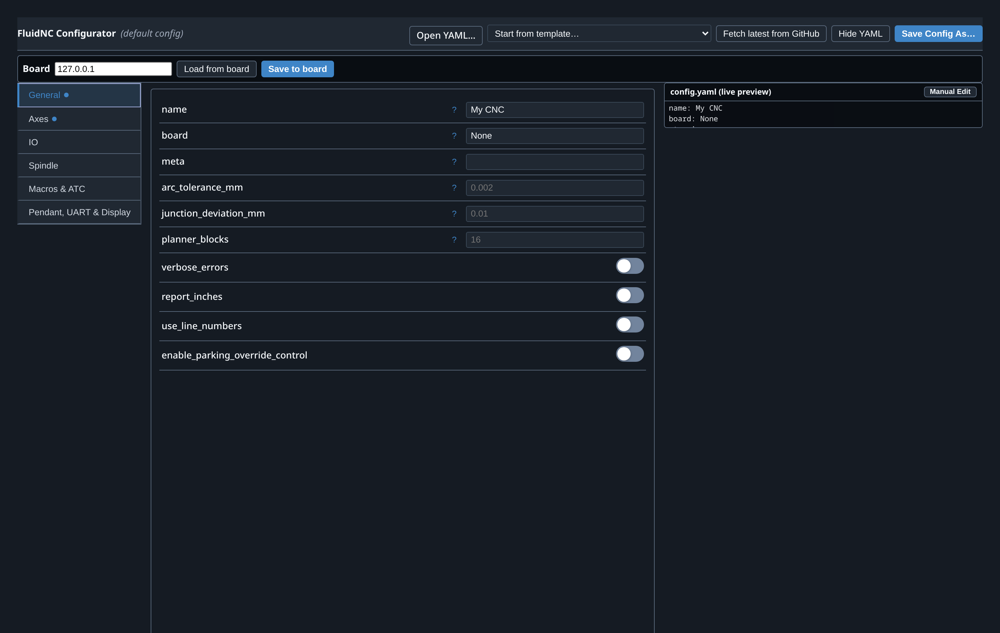
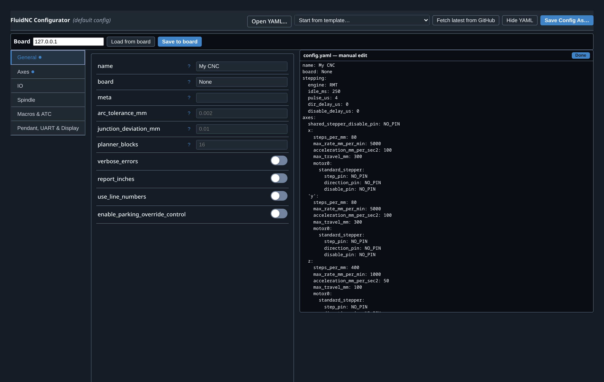
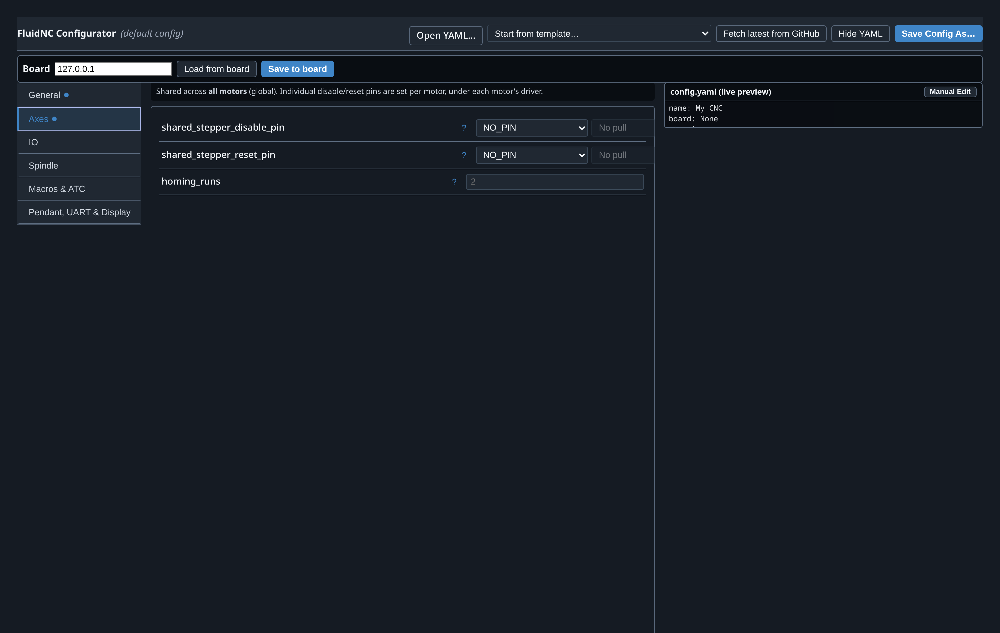
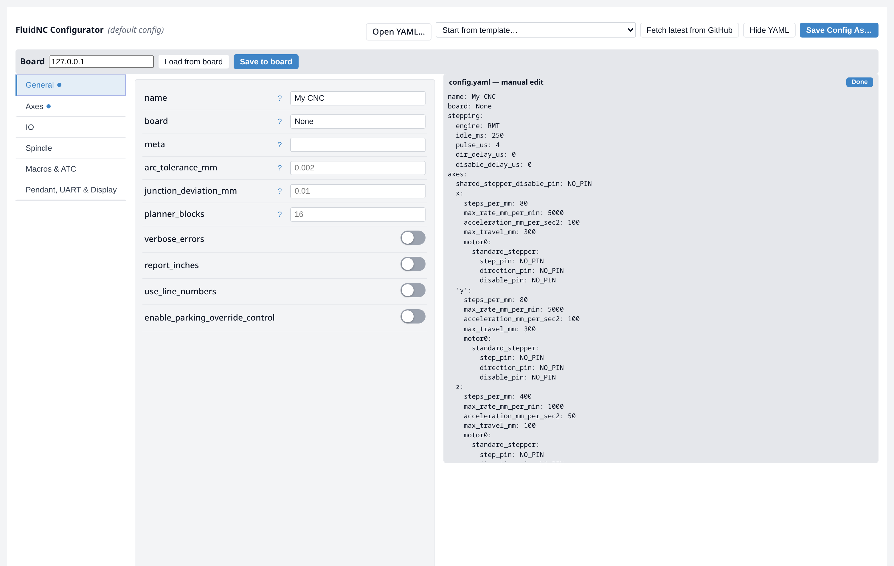
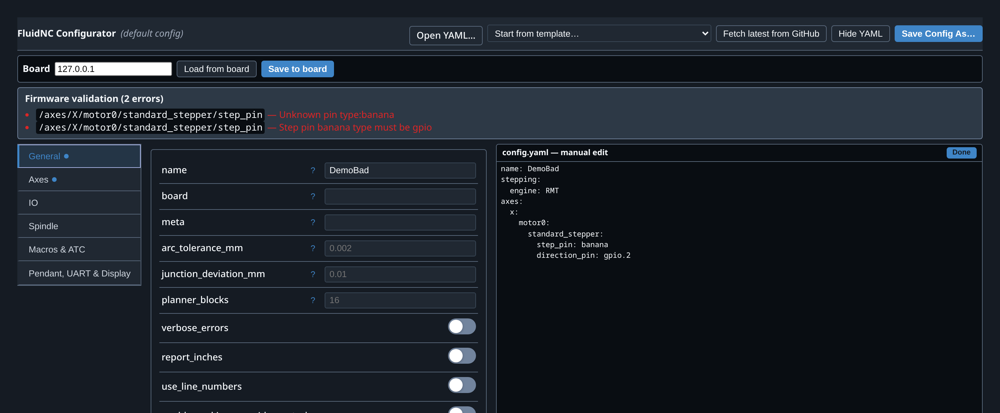

# FluidNC Configurator (gSender plugin)

An offline, schema-driven FluidNC `config.yaml` editor that runs inside gSender
(Tools → FluidNC Config). Driven by FluidNC's official config schema, it renders
a tabbed form with:

- Left-nav sections mirroring the machine (General, Axes, IO, Spindle, Macros &
  ATC, Pendant/UART/Display) with a live `config.yaml` pane.
- ESP32-aware **pin dropdowns** with used-pin conflict detection; `uart_channelN.M`
  pins appear automatically when a UART channel is configured.
- **Pick-one selectors** for motor drivers, kinematics, and spindles — choose a
  type, configure only that type.
- Apple-style enable toggles that add/remove optional sections.
- 118 bundled board templates plus a live browser of the community config repo.
- Board sync (read/write `config.yaml` over the FluidNC WebUI).
- **Firmware-derived validation** on edit/save: a TypeScript port of FluidNC's
  own `Configuration::Validator` pass — pin-type-vs-stepping-engine, unusable
  pins, missing step pins, I2S-bus-required, etc. — reporting the firmware's
  actual messages against `/axes/X/motor0/…`-style paths. See
  [`src/validate.ts`](src/validate.ts); each rule cites the FluidNC source it
  came from. Not bit-for-bit (that needs the firmware itself), but faithful and
  mechanically re-syncable; `npm run check` guards it against regressions.

## Screenshots

| General (dark) | Manual YAML edit |
| --- | --- |
|  |  |

| Axes | Light theme |
| --- | --- |
|  |  |

| Firmware-derived validation |
| --- |
|  |

The pane on the right is a live `config.yaml` preview; **Manual Edit** expands it
into a full editor. **Save Config As…** writes the file wherever you choose.

## References / repositories used

This plugin and the surrounding gSender FluidNC fork build on:

- **[bdring/FluidNC](https://github.com/bdring/FluidNC)** — the firmware; its
  config schema (`tools/fluidnc-config-schema.json`), error/alarm tables, and
  pin grammar drive this editor.
- **[bdring/fluidnc-config-files](https://github.com/bdring/fluidnc-config-files)**
  — the bundled + live-browsable machine config templates.
- **[breiler/fluid-installer](https://github.com/breiler/fluid-installer)** — the
  web installer; its pin-field UX and board pin table were ported here.
- **[cncjs/cncjs](https://github.com/cncjs/cncjs)** — the server/controller
  lineage gSender descends from.
- **[Sienci-Labs/gsender](https://github.com/Sienci-Labs/gsender)** — the host
  application this plugin extends.
- **FluidNC pendant / display:** _<add your pendant repo URL here>_
- **This fork + plugin:**
  [NoobyNull/FluidNC-Gsender-Plugin](https://github.com/NoobyNull/FluidNC-Gsender-Plugin).

Documentation: **[FluidNC wiki](http://wiki.fluidnc.com/)**.

Plugin code written by Claude (Anthropic), via Claude Code.

## Build

```bash
npm install
npm run build   # outputs to ui/
```

Copy `gsender-plugin.json` + `ui/` into gSender's plugins directory
(`~/.config/<gSender app name>/plugins/fluidnc-config/`) and restart gSender.
